  

# Hi, I'm Abdelkrim Bellagnech 👋

Software Engineering student focused on **Software Engineering, DevSecOps & Cloud Engineering**.

I build secure backend and cloud-native systems, with a growing focus on **reliability, automation, security, and production engineering**.

[LinkedIn](https://www.linkedin.com/in/abdelkrim-bellagnech) · [Email](mailto:abdelkrimbellagnech@gmail.com)

---

## About Me

`[EDU]` **Software Engineering student at ENSIBS**, with a strong focus on software security, cloud, and platform engineering  
`[FOCUS]` Interested in **backend systems, cloud infrastructure, platform engineering, and distributed systems**  
`[SEC]` I treat **security, reliability, and observability as design constraints**, not afterthoughts  
`[BUILD]` Currently building [**Tally**](https://github.com/karembe/Tally), my flagship DevSecOps / SRE / systems engineering project  
`[LOC]` Based in **France**

---

## Technologies & Tools

